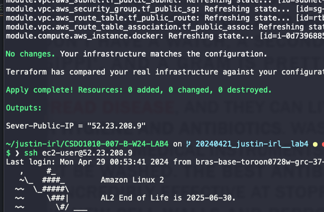
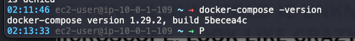
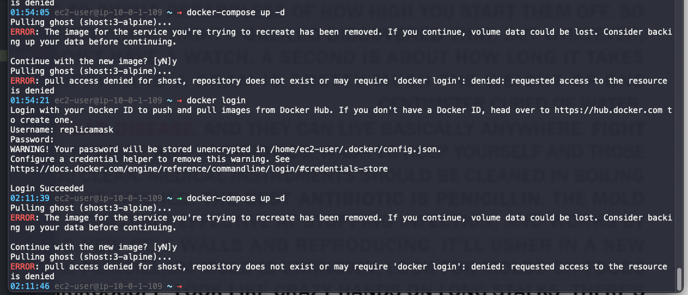
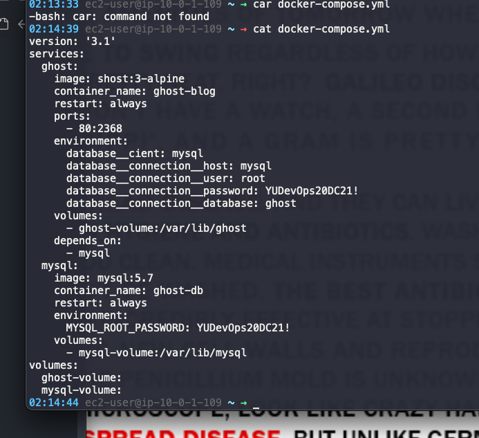

# Lab Evidence

Your report on this lab will be the basis for your grade.  The purpose of the report is to demonstrate to your instructor that you have completed the lab successfully and understood the material.  Please include the following screenshots as part of your evidence.

- `webserver-Public-URL` and the `URL` assigned from the end of the Terraform apply output. Please do not include all of the output from apply, just the `webserver-Public-URL` value

- Output from `docker-compose -version`

- Output from `docker-compose up -d` to bring up the Ghost Blog

- Browser showing Ghost Blog, to include the address bar with public IP of the server you are using

N/A
